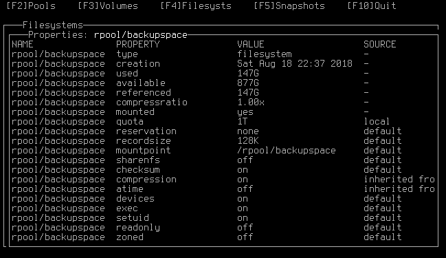

# zfstui
Terminal user interface for the ZFS filesystem





## Installation

### From PyPI
```shell
> pip install zfstui
```

### From git
```shell
> git clone https://github.com/volkerp/zfstui.git
> cd zfstui
> python3 setup.py install
```

