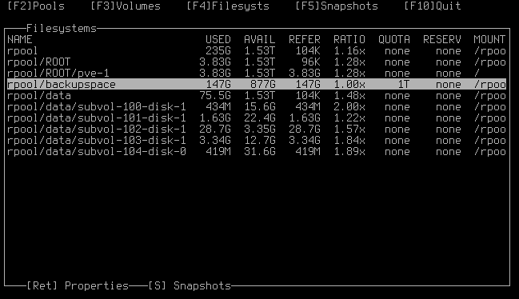

# zfstui
Terminal user interface for the ZFS filesystem




## Installation

### From PyPI
```bash
pip install zfstui
```

### From git
```bash
git clone https://github.com/volkerp/zfstui.git
cd zfstui
python3 setup.py install
```

